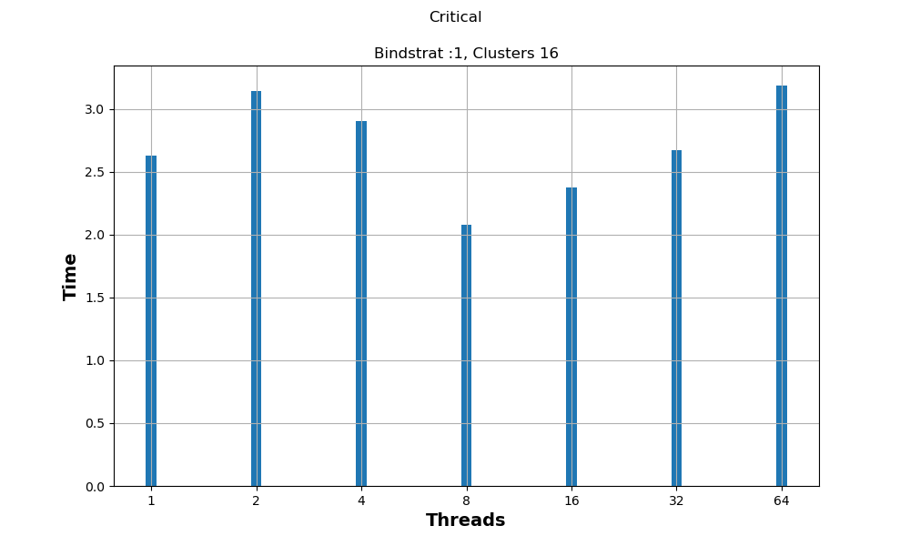
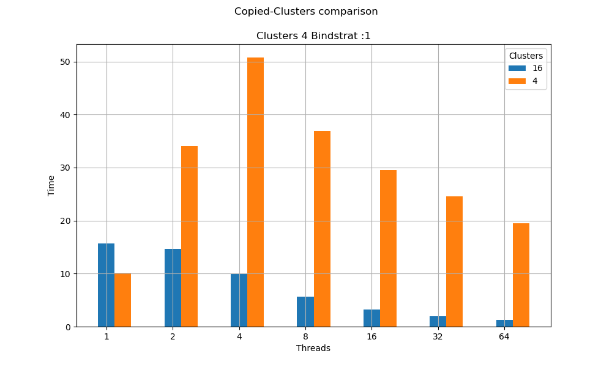
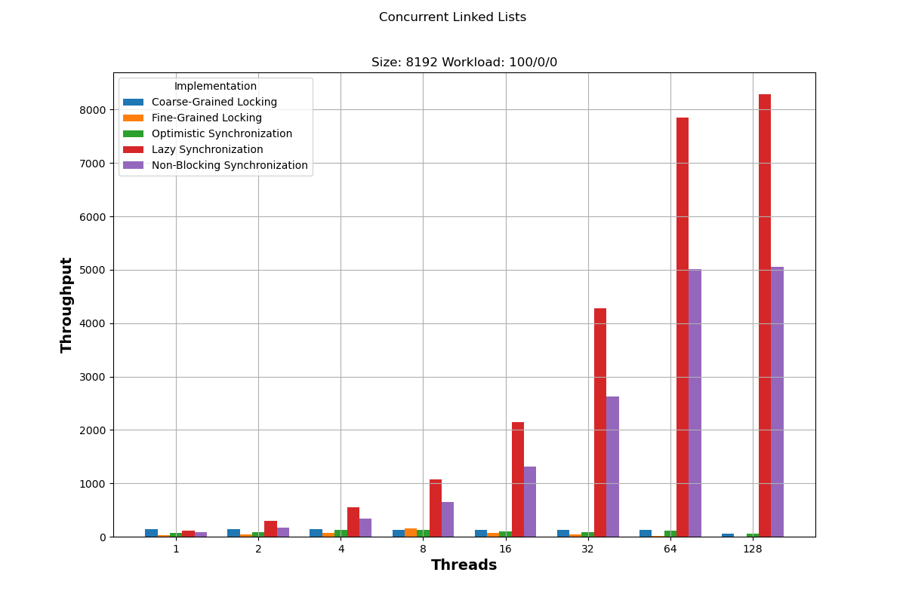

<div align='center'>
  
  <br/>
  <h3>ΕΘΝΙΚΟ ΜΕΤΣΟΒΙΟ ΠΟΛΥΤΕΧΝΙΟ</h3>
  <h4>ΣΧΟΛΗ ΗΛΕΚΤΡΟΛΟΓΩΝ ΜΗΧΑΝΙΚΩΝ ΚΑΙ ΜΗΧΑΝΙΚΩΝ ΥΠΟΛΟΓΙΣΤΩΝ</h4>
  <h5>Συστήματα Παράλληλης Επεξεργασίας</h5>
  <h6>Άσκηση 2: Παραλληλοποίηση και βελτιστοποίηση αλγορίθμων σε αρχιτεκτονικές κοινής μνήμης</h6>
</div>

---

| Όνομα | Επώνυμο | Α.Μ. |
|-------|---------|------|
| Αλτάν    | Αβτζή   | 03119241 |
| Τζόναταν | Λουκάι  | 03119230 |
| Σταύρος  | Λαζάρου | 03112642 |

<br/>
<br/>

## Αλγόριθμος K-means
### Υλοποίηση shared clusters
1. Παραλληλοποίηση υλοποίησης και μετρήσεις
  - Configuration:
    - Size = 256
    - Coords = 16
    - Clusters = 16
    - Loops = 10
  - Για την παραλληλοποίηση αυτής της έκδοσης του αλγορίθμου κάναμε χρήση του `omp parallel for` για τον διαμοιρασμό των εργασιών και `omp atomic` για την ασφαλή εγγραφή σε δεδομένα
  ```c
  /* ... */

  #pragma omp parallel for \
    private(i,j,index) \
    firstprivate(numObjs,numClusters,numCoords) \
    shared(objects,clusters,membership,newClusters,newClusterSize) \
    schedule(static) reduction(+:delta)

  for (i=0; i<numObjs; i++) { /* ... */ }
  ```

  ```c
  /* ... */

  #pragma omp atomic
  newClusterSize[index]++;
  for (j=0; j<numCoords; j++) {
      #pragma omp atomic
      newClusters[index*numCoords + j] += objects[i*numCoords + j];
  }

  /* ... */
  ```

  Με αυτόν τον κώδικα επιτυγχάνεται η παραλληλοποίηση του αλγορίθμου K-means σε κοινή μνήμη, κατανέμοντας τον φόρτο εργασίας σε πολλαπλά νήματα, στοχεύοντας την αυξημένη επίδοση.

  Οι 'ατομικές' οδηγίες που παραθέτονται, χρησιμοποιούνται για να διαβεβαιώσουμε ότι το κρίσιμο σημείο του κώδικα εκτελείται ατομικά, και έτσι αποτρέπονται τα race conditions στις κοινές μεταβλητές.

  - Γραφικές Παραστάσεις

  <div>
    
    
  </div>

  Παρατηρούμε ότι η επίδοση του αλγορίθμου στην παραλληλοποιημένη εκδοσή του δεν επιτυγχάνει ικανοποιητική επίδοση σε σχέση με τη σειριακή. Ο καλύτερος χρόνος προέρχεται χρησιμοποιώντας 8 νήματα, όπου βελτιώνεται η επίδοση σε σχέση με τον σειριακό χρόνο, άλλα όχι σε μεγάλο βαθμό.

  Η προσθήκη νημάτων αποδεικνύεται ότι επιδεινώνει την ταχύτητα του προγράμματος, παρά να την αυξάνει. Αυτό μπορεί να συμβαίνει επειδή:
   - Όσο αυξάνεται ο αριθμός των νημάτων, αυξάνεται παράλληλα και το κόστος σε χρόνο δημιουργίας και καταστροφής τους, το κόστος συγχρονισμού, κλπ. Από ένα σημείο και μετά αυτά τα κόστη υπερτερούν τα οφέλη που μπορεί να προσφέρει η παραλληλοποιήση, με αποτέλεσμα να μειώνεται η απόδοση του προγράμματος.
   - Στον προκείμενο αλγόριθμο είναι σχετικά περιορισμένες οι δυνατότητες παραλληλοποίησης, λόγω της απαίτησης συγχρονισμού σε ορισμένα σημεία του κώδικα.
   - Με την αύξηση των νημάτων αυξάνεται και η απαίτηση πόρων μνήμης και cache. Από τη στιγμή που αυτοί οι πόροι είναι ασυνεπείς με τις απαιτήσεις, περιορίζεται η βελτίωση της επίδοσης που μπορεί να επιτευχθεί με την προσθήκη νημάτων στο πρόγραμμα.
   - Από τον νόμο του Amdahl γνωρίζουμε ότι η αύξηση ταχύτητας ενός προγράμματος μέσω του παραλληλισμού είναι περιορισμένη από το κομμάτι που πρέπει να εκτελεστεί σειριακά. Όποτε όσο προσθέτουμε νήματα, η επίπτωση αυτών των σειριακών κομματιών είναι όλο και πιο εμφανής.

2. Thread Binding
  - Το thread binding αναφέρεται στην πρόσδεση νημάτων σε ορισμένους πυρήνες. Σκοπός του είναι η βελτιστοποίηση απόδοσης μέσω διαφορετικών στρατηγικών κατανομής των νημάτων.
  - Η μεταβλητή GOMP_CPU_AFFINITY μας επιτρέπει να καθορίσουμε την εν λόγω στρατηγική κατανομής νημάτων που θέλουμε να ακολουθήσει το πολυνηματικό πρόγραμμα που θα εκτελέσουμε.
  - Οι στρατηγικές κατανομής που πειραματιστήκαμε:
    - :2 -> 2 threads per core - 32 cores max
    - :4 -> 4 threads per core - 16 cores max
    - :8 -> 8 threads per core - 8 cores max
    - :16 -> 16 threads per core - 4 cores max
    - :32 -> 32 threads per core - 2 cores max
  - Γραφικές Παραστάσεις

  <div>
    
  </div>

  Παρατηρούμε ότι η επιλογή διαφορετικών στρατηγικών κατανομής νημάτων σε πυρήνες έχει σημαντική επίδραση στην επίδοση του προγράμματος. Στρατηγικές που επιτρέπουν πολλαπλά νήματα ανά πυρήνα, φαίνεται να έχουν καλύτερους χρόνους, αλλά και κλιμάκωση, όσο αυξάνονται τα νήματα.

  Ένας από τους λόγους που παρατηρείται αυτή η βελτίωση στην επίδοση μπορεί να είναι το Hyperthreading (SMT). Το Hyperthreading επιτρέπει έναν πυρήνα να εκτελεί ταυτόχρονα πολλαπλά νήματα, γεγονός το οποίο έχει πλεονεκτήματα όπως καλύτερη αξιοποίηση της cache και χαμηλότερη διαμάχη μεταξύ μοιραζόμενων πόρων.


### Υλοποίηση copied clusters and reduce

1. Παραλληλοποίηση υλοποίησης και μετρήσεις
  - Configuration:
    - Size = 256
    - Coords = 16
    - Clusters = 16
    - Loops = 10
  - Για την παραλληλοποίηση αυτής της έκδοσης του αλγορίθμου κάναμε χρήση και πάλι του `omp parallel for`, αλλά αυτή τη φορά δε χρειάστηκε να ασχοληθούμε με τον συγχρονισμό των κρίσιμων δεδομένων.

  ```c
  /* ... */

  // Initialize local (per-thread) arrays (and later collect result on global arrays)
  for (k=0; k<nthreads; k++)
  {
    local_newClusterSize[k] = (typeof(*local_newClusterSize)) calloc(numClusters, sizeof(**local_newClusterSize));
    local_newClusters[k] = (typeof(*local_newClusters)) calloc(numClusters * numCoords, sizeof(**local_newClusters));
  }

  /* ... */
  ```
  ```c
  /* ... */

  // Parallelize for loop
  #pragma omp parallel for \
    private(i,j,index) \
    firstprivate(numObjs,numClusters,numCoords) \
    shared(objects,clusters,membership,newClusters,newClusterSize, local_newClusters,local_newClusterSize) \
    schedule(static) reduction(+:delta)

  for (i=0; i<numObjs; i++) { /* ... */ }

  /* ... */
  ```
  ```c
  /* ... */

  // update new cluster centers : sum of all objects located within (average will be performed later)
  local_newClusterSize[omp_get_thread_num()][index]++;
  for (j=0; j<numCoords; j++)
    local_newClusters[omp_get_thread_num()][index*numCoords + j] += objects[i*numCoords + j];

  /* ... */
  ```
  ```c
  /* ... */

  // Reduction of cluster data from local arrays to shared.
  for(k=0; k<nthreads; ++k) {
    for(i=0; i<numClusters; ++i) {
      newClusterSize[i] += local_newClusterSize[k][i];
      for(j=0; j<numCoords; ++j)
        newClusters[i*numCoords + j] += local_newClusters[k][i];
    }
  }

  /* ... */
  ```

  Με αυτήν την υλοποίηση, η χρήση τοπικών πινάκων επιτρέπει σε κάθε νήμα να υπολογίζει ανεξάρτητα τα αποτελέσματα του, και το βήμα του "reduce" συναθροίζει αυτά τα αποτελέσματα στους τελικούς πίνακες.

  - Γραφικές Παραστάσεις

  <div>
    
    
  </div>
  <div>
    
    
  </div>

  Παρατηρούμε ότι η συγκεκριμένη έκδοση, όχι μόνο επιδεικνύει βελτιωμένη επίδοση στα αποτελέσματά της από την προηγούμενη, αλλά και επιτυγχάνει αρκετά ικανοποιητική επίδοση για παραλληλοποιημένο πρόγραμμα.

  Η διαφορά μεταξύ των δύο εκδόσεων οφείλεται στην παρουσία ανάγκης ή μη για συγχρονισμό. Η τεχνική παραλληλισμού που παρουσιάζει η δεύτερη έκδοση, εξουδετερώνει πλήρως τη σειριοποίηση στο κομμάτι του συγχρονισμού, με αποτέλεσμα η παραλληλοποίηση να γίνεται πιο αποδοτική.


2. False-sharing και first-touch

  - Configuration:
    - Size = 256
    - Coords = 16
    - Clusters = 4
    - Loops = 10

  - Γραφικές παραστάσεις
  <div>
    
    
  </div>

  Παρατηρούμε ότι μια παράξενη και μη αναμενόμενη μείωση στην επίδοση. Αυτό οφείλεται στο false sharing, όπου σε αυτό το φαινόμενο τα νήματα εμφανίζουν μια πιο συχνή διαμάχη στα διαμοιραζόμενα cache lines. Αυτό έχει ως αποτέλεσμα να αυξάνεται η κίνηση στη cache και η ανάγκη για συγχρονισμό μεταξύ των νημάτων, και συνεπώς να επηρεάζεται η επίδοση.

  - Υλοποίηση first-touch
  ```c
  /* ... */

  #pragma omp parallel for \
    private(i, j, k) \
    firstprivate(numClusters, numCoords) \
    shared(local_newClusterSize, local_newClusters) \
    schedule(static)
  for(k=0; k<nthreads; ++k)
  {
    local_newClusterSize[k] = (typeof(*local_newClusterSize)) calloc(numClusters, sizeof(**local_newClusterSize));
    local_newClusters[k] = (typeof(*local_newClusters)) calloc(numClusters * numCoords, sizeof(**local_newClusters));

    // first-touch
    for(i=0; i<numClusters; ++i)
    {
      local_newClusterSize[k][i] = 0;
      for(j=0; j<numCoords; ++j)
        local_newClusters[k][i * numCoords + j] = 0.0;
    }
  }

  /* ... */
  ```
  Για την αντιμετώπιση του "false-sharing" φαινομένου, αξιοποιούμε την πολιτική "first-touch" του Linux. Τόσο η παραχώρηση μνήμης (allocation), όσο και η αρχικοποίηση (initialization) των δύο αντιγραμμένων πινάκων γίνεται μέσα σε μια `omp parallel for` οδηγία του `OpenMP`, έτσι ώστε να πετύχουμε ανεξάρτητη τοποθεσία αποθήκευσης δεδομένων για κάθε νήμα στη cache. Με αυτή τη στρατηγική αποτρέπουμε τις συνέπειες που επιφέρει το "false-sharing", καθιερώνοντας ξεκάθαρη ιδιοκτησία χώρου μνήμης μεταξύ νημάτων.


  - Γραφικές Παραστάσεις
  <div>
    
    
  </div>

  Παρατηρούμε ότι η υλοποίηση reduction με first-touch πολιτική επιδεικνύει σημαντικά βελτιωμένη επίδοση και κλιμάκωση σε σύγκριση με την κανονική υλοποίηση για κάθε πλήθος νημάτων. Αυτό οφείλεται στην ικανότητα αυτής της πολιτικής να αξιοποιεί την τοπικότητα της cache (cache locality).


### Αμοιβαίος Αποκλεισμός - Κλειδώματα

1. Γραφικές Παραστάσεις

<div>
  
  
</div>
<div>
  
  
</div>

Παρατηρούμε ότι η παραλληλοποίηση με χρήση κλειδωμάτων δεν είναι ικανή να φέρει βελτιώσεις στην ταχύτητα του αλγορίθμου. Με την αύξηση των νημάτων σχεδόν σε κάθε περίπτωση, αυξάνεται και το αντίστοιχο κόστος που επιφέρει το κάθε κλείδωμα. Ειδικότερα σε ορισμένους (i.e test-and-set lock) αυτό το κόστος είναι πανάκριβο. Το κλείδωμα για συγχρονισμό αποδεικνύεται βλαβερό για τον παραλληλισμό, καθώς η επίδοση σε σύγκριση με εναλλακτικές ασύγχρονες υλοποιήσεις (no-sync lock, atomic operations, copied clusters) είναι σημαντικά πιο αποδοτικές.


## Αλγόριθμος Floyd-Warshall
 - Για την παραλληλοποίηση αυτής της έκδοσης του αλγορίθμου κάναμε χρήση του `omp task` για τον διαμοιρασμό των εργασιών που μπορούν να παραλληλοποιηθούν.
 ```c
  /* ... */

  else {

    FW_SR(A,arow, acol,B,brow, bcol,C,crow, ccol, myN/2, bsize);

    #pragma omp parallel
    {
      #pragma omp single
      {
        #pragma omp task shared(A, B, C)
          FW_SR(A,arow, acol+myN/2,B,brow, bcol,C,crow, ccol+myN/2, myN/2, bsize);
        #pragma omp task shared(A, B, C)
          FW_SR(A,arow+myN/2, acol,B,brow+myN/2, bcol,C,crow, ccol, myN/2, bsize);
        #pragma omp taskwait
      }
    }

    FW_SR(A,arow+myN/2, acol+myN/2,B,brow+myN/2, bcol,C,crow, ccol+myN/2, myN/2, bsize);
    FW_SR(A,arow+myN/2, acol+myN/2,B,brow+myN/2, bcol+myN/2,C,crow+myN/2, ccol+myN/2, myN/2, bsize);

    #pragma omp parallel
    {
      #pragma omp single
      {
        #pragma omp task shared(A, B, C)
          FW_SR(A,arow+myN/2, acol,B,brow+myN/2, bcol+myN/2,C,crow+myN/2, ccol, myN/2, bsize);
        #pragma omp task shared(A, B, C)
          FW_SR(A,arow, acol+myN/2,B,brow, bcol+myN/2,C,crow+myN/2, ccol+myN/2, myN/2, bsize);
        #pragma omp taskwait
      }
    }

    FW_SR(A,arow, acol,B,brow, bcol+myN/2,C,crow+myN/2, ccol, myN/2, bsize);

  }

  /* ... */
  ```
  Η παραλληλοποίηση σε αυτόν τον κώδικα είναι επιλεκτικός. Επιτυγχάνεται στα σημεία που μπορούν να εκτελεστούν ανεξάρτητα, και αποφεύγεται σε αυτά που εξαρτώνται από άλλα σημεία.

  - Γραφικές Παραστάσεις

  <div>
    
    
    
  </div>

  Παρατηρούμε από τις μετρήσεις ότι προφανώς οι χρόνοι αυξάνονται με την αύξηση μεγέθους του πίνακα. Επίσης, παρατηρούμε ότι υπάρχει καλύτερη επίδοση για μεγαλύτερα Block sizes, επειδή το κόστος διαχείρισης πόρων είναι μικρότερο σε σύγκριση με μικρότερα μεγέθη.

  Σημαντική παρατήρηση είναι ότι δεν εμφανίζεται βελτίωση στους χρόνους μετά τα 2 νήματα. Μεταξύ και άλλων διαφόρων λόγων, το γεγονός ότι κάθε φορά στο πρόγραμμα εκτελούνται παράλληλα μόνο 2 tasks, εξηγεί αυτήν την έλλειψη βελτίωσης σε παραπάνω από 2 νήματα.


## Ταυτόχρονες Δομές Δεδομένων

1. Γραφικές Παραστάσεις

  <div>
    
    
    
    
  </div>

  ----

  <div>
    
    
    
    
  </div>

  - Coarse-grain locking
    - Ένα lock για όλη τη λίστα.
    - Απλή υλοποίηση αλλά αρκετά αργή γιατί κλειδώνει κομμάτια και από ανεξάρτητες λειτουργίες.
    - Με την αύξηση των νημάτων, μειώνεται το throughput. Λογικό αφού αυξάνονται και οι διαμάχες μεταξύ νημάτων.
  - Fine-grain locking
    - Πολλαπλά locks για μικρότερα τμήματα λίστας.
    - Πιο περιπλοκή υλοποίηση από coarse-grain, αλλά θεωρητικά πιο γρήγορη.
    - Με την αύξηση των νημάτων, δεν αυξάνεται σημαντικά το throughput, ενώ μπορεί και να μειωθεί λόγω αυξημένων διαμαχών. Αυτό παρατηρείται κυρίως σε μεγάλο πλήθος νημάτων.
    - Συχνά πιο αργή από coarse-gain για μικρό αριθμό νημάτων, λόγω αυξημένης περιπλοκότητας στην υλοποίηση.
  - Optimistic synchronization
    - Υλοποίηση χωρίς locks, αλλά με έλεγχο και διόρθωση.
    - Σχετικά απλή και εν γένει πιο γρήγορη από κλειδώματα.
    - Αδυνατεί στα λίγα νήματα, αλλά επωφελείται πολύ περισσότερο στα πολλά, λόγω της μη συχνής ανάγκης για συγχρονισμό.
  - Lazy synchronization
    - Παρόμοια υλοποίηση με optimistic, αλλά πιο "έξυπνη".
    - Πιο περίπλοκη από optimistic, αλλά πιο γρήγορη.
    - Επωφελείται σημαντικά με την αύξηση των νημάτων.
    - Γρηγορότερη σε contains λειτουργίες.
  - Non-blocking synchronization
    - Ανθεκτική υλοποίηση που αποτρέπει την αποτυχία ενός νήματος να καθυστερήσει τα υπόλοιπα.
    - Αρκετά περίπλοκη, αλλά θεωρητικά η πιο γρήγορη.
    - Επωφελείται σημαντικά με την αύξηση των νημάτων.
    - Γρηγορότερη σε add και remove λειτουργίες.
