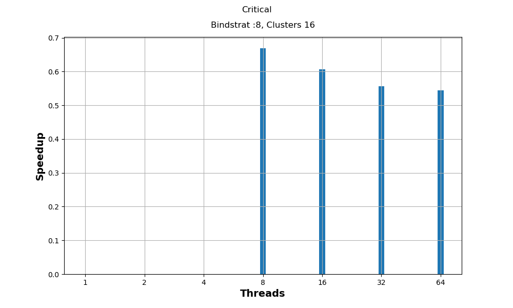
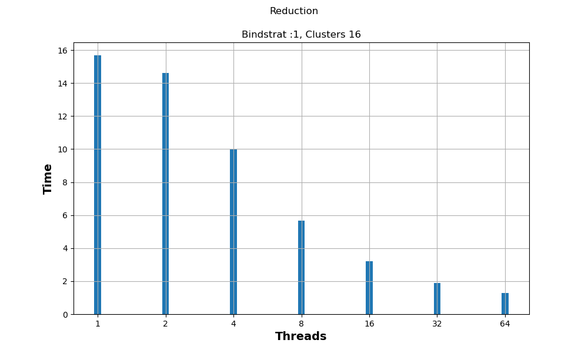
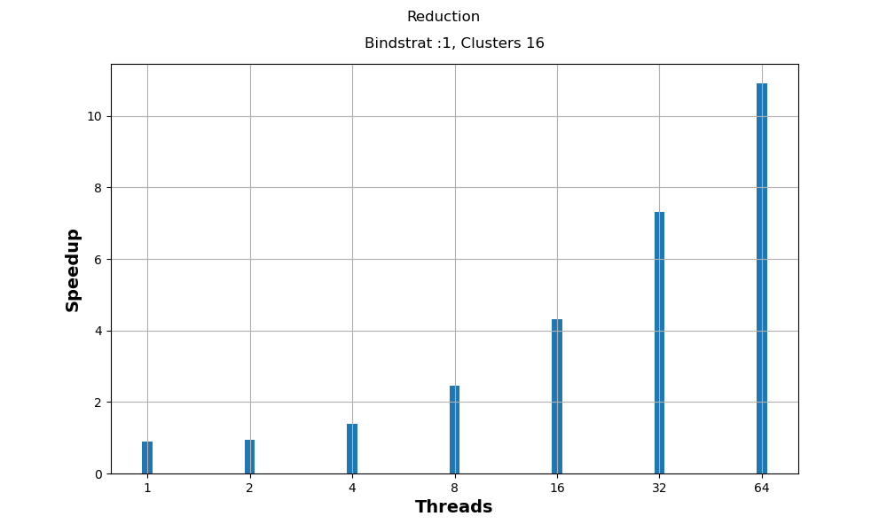
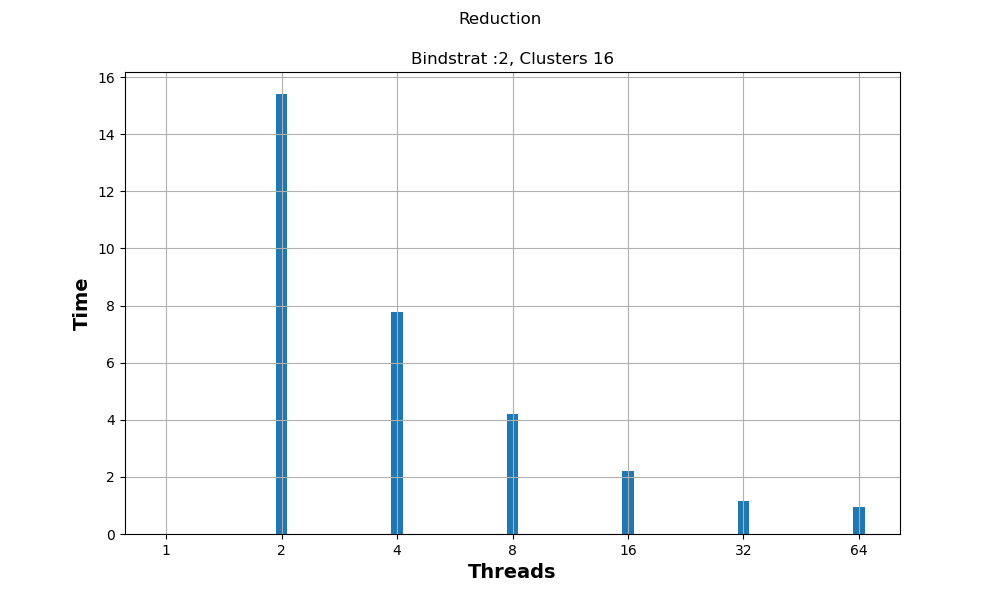
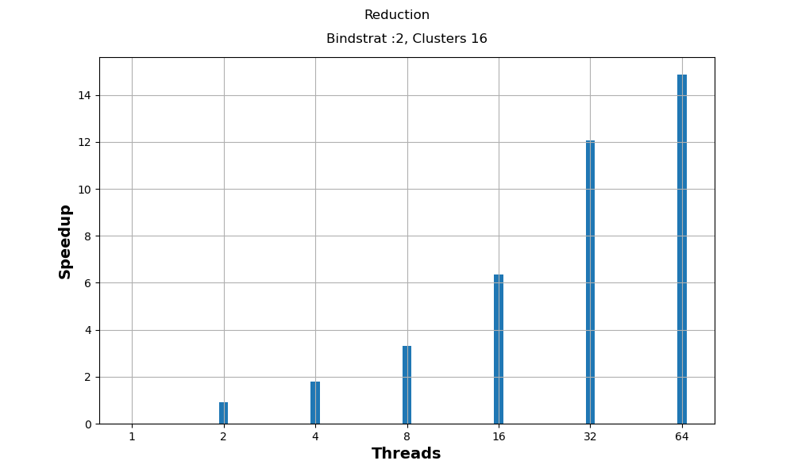

<div align='center'>
  
  <br/>
  <h3>ΕΘΝΙΚΟ ΜΕΤΣΟΒΙΟ ΠΟΛΥΤΕΧΝΙΟ</h3>
  <h4>ΣΧΟΛΗ ΗΛΕΚΤΡΟΛΟΓΩΝ ΜΗΧΑΝΙΚΩΝ ΚΑΙ ΜΗΧΑΝΙΚΩΝ ΥΠΟΛΟΓΙΣΤΩΝ</h4>
  <h5>Συστήματα Παράλληλης Επεξεργασίας</h5>
  <h6>Άσκηση 2: Παραλληλοποίηση και βελτιστοποίηση αλγορίθων σε αρχιτεκτονικές κοινής μνήμης</h6>
</div>

---

| Όνομα | Επώνυμο | Α.Μ. |
|-------|---------|------|
| Αλτάν    | Αβτζή   | 03119241 |
| Τζόναταν | Λουκάι  | 03119230 |
| Σταύρος  | Λαζάρου | 03112888 |

<br/>
<br/>

## Αλγόριθμος K-means
### Υλοποίηση shared clusters
1. Παραλληλοποίηση υλοποίησης και μετρήσεις
  - Configuration:
    - Size = 256
    - Coords = 16
    - Clusters = 16
    - Loops = 10
  - Για την παραλληλοποίηση αυτής της εκδοσης τους αλγορίθμου κάναμε χρήση του `omp parallel for` για τον διαμοιρασμό των εργασιών και `omp atomic` για την ασφαλή εγγραφή σε δεδομένα
  ```c
  /* ... */

  #pragma omp parallel for \
    private(i,j,index) \
    firstprivate(numObjs,numClusters,numCoords) \
    shared(objects,clusters,membership,newClusters,newClusterSize) \
    schedule(static) reduction(+:delta)

  for (i=0; i<numObjs; i++) { /* ... */ }
  ```

  ```c
  /* ... */

  #pragma omp atomic
  newClusterSize[index]++;
  for (j=0; j<numCoords; j++) {
      #pragma omp atomic
      newClusters[index*numCoords + j] += objects[i*numCoords + j];
  }

  /* ... */
  ```

  sxolia gia ton kodika...

  - Γραφικές Παραστάσεις

  <div>
    
    
  </div>

  sxolia gia tis metriseis...

2. Thread Binding
  - ti einai to thread binding kai i metavliti GOMP_CPU_AFFINITY
  - ti peiramata kaname
    - :2 -> 2 threads per core - 32 cores max
    - :4 -> 4 threads per core - 16 cores max
    - :8 -> 8 threads per core - 8 cores max
    - :16 -> 16 threads per core - 4 cores max
    - :32 -> 32 threads per core - 2 cores max
  - Γραφικές Παραστάσεις

  <div>
    
    
  </div>
  <div>
    
    
  </div>
  <div>
    
    
  </div>
  <div>
    
    
  </div>
  <div>
    
    
  </div>
  <div>
    
    
  </div>
  
  sxolia gia tis metriseis...


### Υλοποίηση copied clusters and reduce

1. Παραλληλοποίηση υλοποίησης και μετρήσεις
  - Configuration:
    - Size = 256
    - Coords = 16
    - Clusters = 16
    - Loops = 10
  - Για την παραλληλοποίηση αυτής της εκδοσης τους αλγορίθμου κάναμε χρήση του... 
  ```c
  /* ... */

  /* ... */
  ```
  ```c
  /* ... */

  /* ... */
  ```
  ```c
  /* ... */

  /* ... */
  ```

  sxolia gia ton kodika...

  - Γραφικές Παραστάσεις

  <div>
    
    
  </div>
  <div>
    
    
  </div>

  sxolia gia tis metriseis...


2. False-sharing και first-touch

  - Configuration:
    - Size = 256
    - Coords = 16
    - Clusters = 16
    - Loops = 10

  - Γραφικές παραστάσεις
  <div>
    
    
  </div>
  
  sxolia gia tis metriseis...

  - Υλοποίηση first-touch
  ```c
  /* ... */

  /* ... */
  ```
  sxolia gia ton kwdika...


  - Γραφικές Παραστάσεις
  <div>
    
    
  </div>

  sxolia gia tis metriseis...


## Αλγόριθμος Floyd-Warshall
 - Για την παραλληλοποίηση αυτής της εκδοσης τους αλγορίθμου κάναμε χρήση του...
 ```c
  /* ... */

  /* ... */
  ```
  sxolia gia ton kwdika...

  - Γραφικες Παραστάσεις

  <div>
    
    
    
  </div>

  sxolia gia tis metriseis...