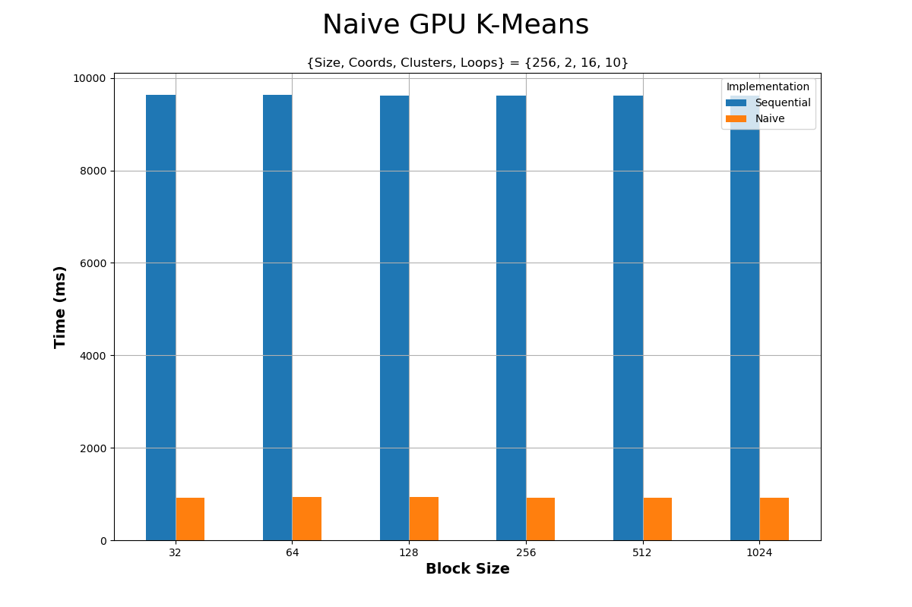
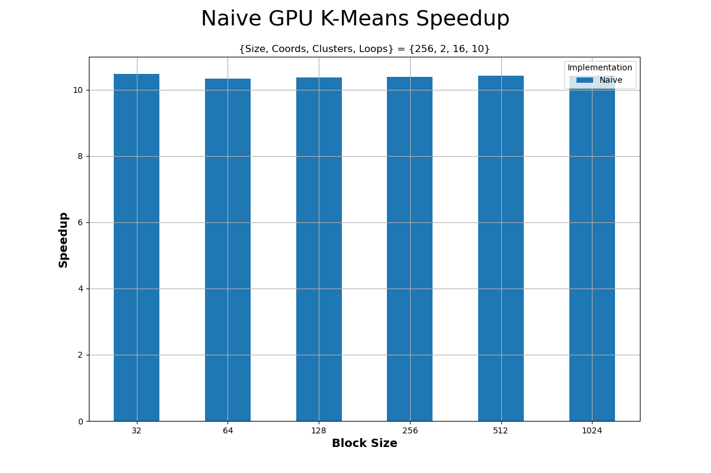
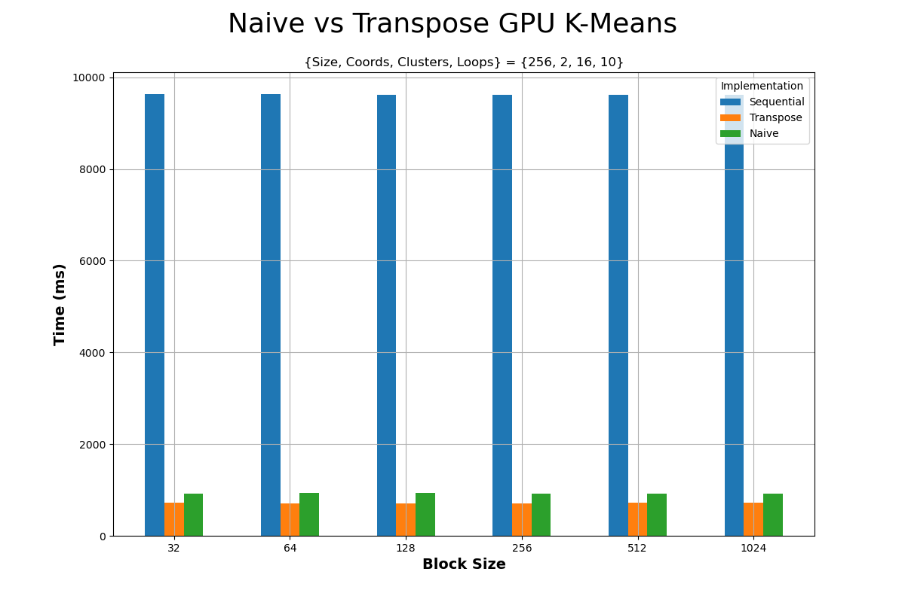
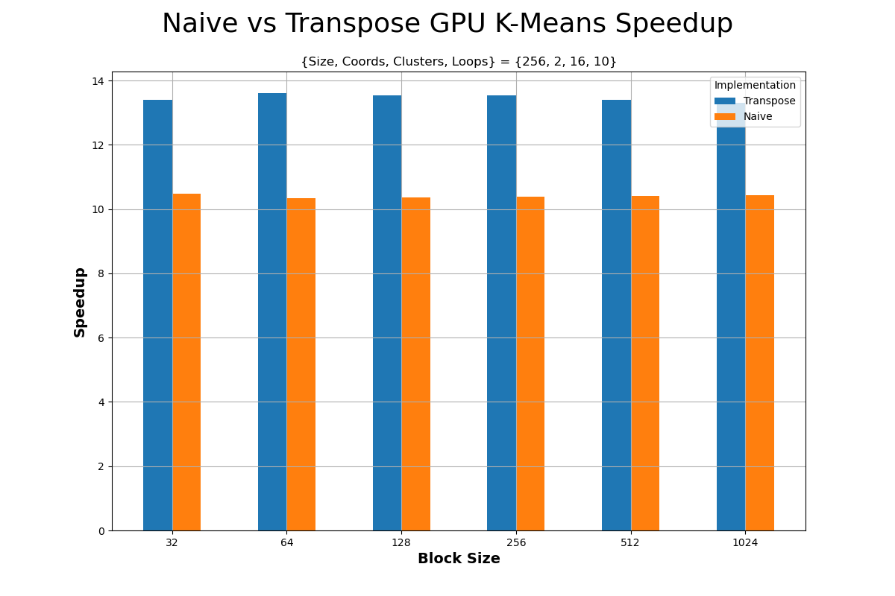
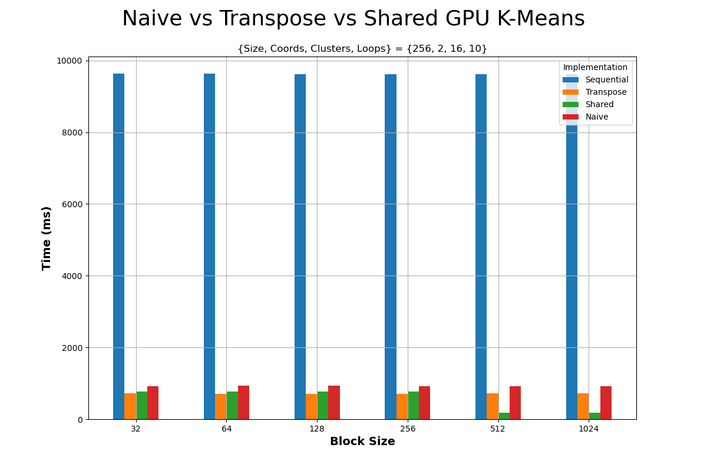
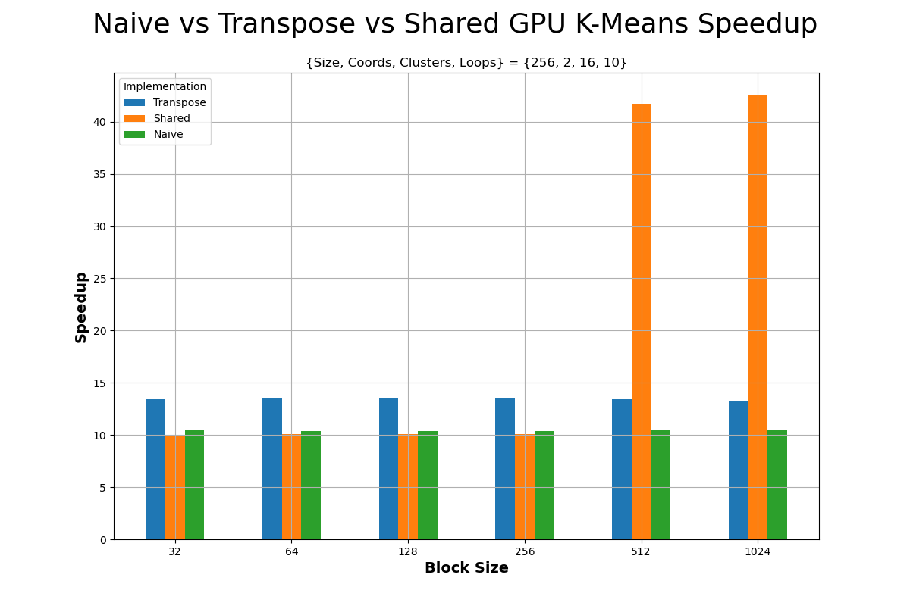
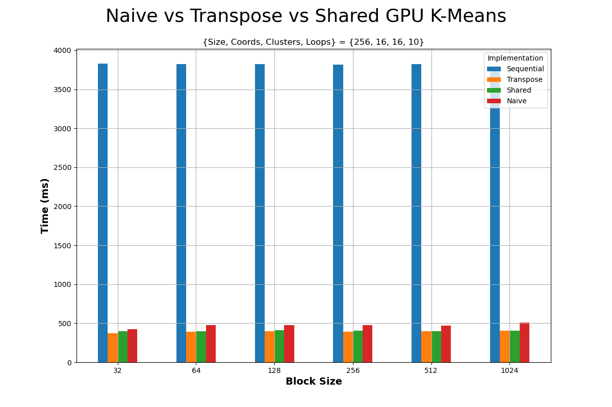
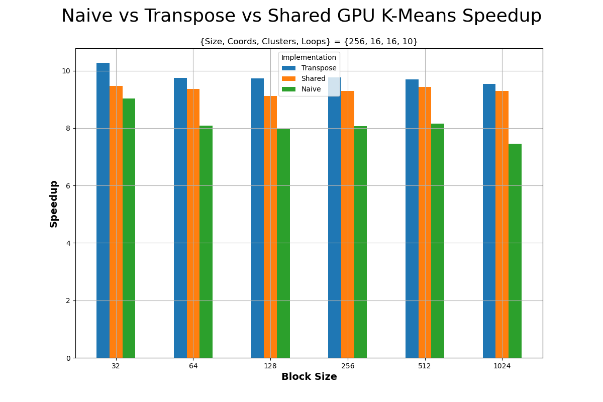

<div align='center'>
  
  <br/>
  <h3>ΕΘΝΙΚΟ ΜΕΤΣΟΒΙΟ ΠΟΛΥΤΕΧΝΙΟ</h3>
  <h4>ΣΧΟΛΗ ΗΛΕΚΤΡΟΛΟΓΩΝ ΜΗΧΑΝΙΚΩΝ ΚΑΙ ΜΗΧΑΝΙΚΩΝ ΥΠΟΛΟΓΙΣΤΩΝ</h4>
  <h5>Συστήματα Παράλληλης Επεξεργασίας</h5>
  <h6>Άσκηση 3: Παραλληλοποίηση και βελτιστοποίηση αλγορίθμων σε επεξεργαστές γραφικών</h6>
</div>

---

| Όνομα | Επώνυμο | Α.Μ. |
|-------|---------|------|
| Αλτάν    | Αβτζή   | 03119241 |
| Τζόναταν | Λουκάι  | 03119230 |
| Σταύρος  | Λαζάρου | 03112642 |

<br/>
<br/>

## Αλγόριθμος K-means
### Υλοποίηση Naive version
1. Υλοποίηση κώδικα
  - Υλοποίηση υπορουτίνας `get_tid()`:
```c
__device__ int get_tid()
{
  return blockDim.x * blockIdx.x + threadIdx.x;
}
```
  - Yλοποίηση υπορουτίνας `euclid_dist_2()` :
```c
__host__ __device__ inline static
double euclid_dist_2()
{
  int i;
  double ans=0.0;

  for (i=0; i<numCoords; i++)
    ans += (objects[objectId*numCoords + i] - clusters[clusterId*numCoords + i]) *
           (objects[objectId*numCoords + i] - clusters[clusterId*numCoords + i]);

  return(ans);
}
```
  - Yλοποίηση του πυρήνα `find_nearest_cluster()` :
```c
  __global__ static
void find_nearest_cluster()
{

	/* Get the global ID of the thread. */
    int tid = get_tid();

    if (tid < numObjs) {
        int   index, i;
        double dist, min_dist;

        /* find the cluster id that has min distance to object */
        index = 0;
        min_dist = euclid_dist_2(numCoords, numObjs, numClusters, objects, deviceClusters, tid, 0);

        for (i=1; i<numClusters; i++) {
            dist = euclid_dist_2(numCoords, numObjs, numClusters, objects, deviceClusters, tid, i);

            /* no need square root */
            if (dist < min_dist) {
            /* find the min and its array index*/
                min_dist = dist;
                index    = i;
            }
        }

        if (deviceMembership[tid] != index) {
            atomicAdd(devdelta, 1.0);
        }

        /* assign the deviceMembership to object objectId */
        deviceMembership[tid] = index;
    }}
```

  - Πραγματοποιούμε  τις ζητούμενες μεταφορές δεδομένων σε κάθε iteration του αλγορίθμου:
```c
checkCuda(cudaMemcpy(deviceClusters, clusters, numClusters*numCoords*sizeof(double), cudaMemcpyHostToDevice));

/* ... */

checkCuda(cudaMemcpy(membership, deviceMembership, numObjs*sizeof(int), cudaMemcpyDeviceToHost));

checkCuda(cudaMemcpy(&delta, dev_delta_ptr, sizeof(double), cudaMemcpyDeviceToHost));
```


2. Αξιολόγηση επίδοσης:

  - Γραφικές Παραστάσεις



sxolia gia tis metriseis...

### Υλοποίηση Transpose version

1. Υλοποίηση κώδικα

  - Yλοποίηση του πυρήνα `euclid_dist_2_transpose()` :
```c
__host__ __device__ inline static
double euclid_dist_2_transpose()
{
  int i;
  double ans=0.0;

  for (i=0; i<numCoords; i++) {
    ans += (objects[i*numObjs + objectId] - clusters[i*numClusters + clusterId]) *
           (objects[i*numObjs + objectId] - clusters[i*numClusters + clusterId]);
  }

    return(ans);
}
```

  - Φροντίζουμε επίσης για την σωστή αρχικοποίηση και μετατροπή των δεδομένων:
```c
double  **dimObjects = (double**) calloc_2d (numCoords, numObjs, sizeof(double));

double  **dimClusters = (double**) calloc_2d (numCoords, numClusters, sizeof(double));

double  **newClusters = (double**) calloc_2d (numCoords, numClusters, sizeof(double));

/* ... */

for(i=0; i<numObjs; i++) {
  for(j=0; j<numCoords; j++) {
    dimObjects[j][i] = objects[i*numCoords + j];
  }
}

/* ... */

const unsigned int numClusterBlocks = (numObjs + numThreadsPerClusterBlock - 1) / numThreadsPerClusterBlock;

/* ... */

for(i=0; i<numClusters; i++) {
  for(j=0; j<numCoords; j++) {
    clusters[i*numCoords + j] = dimClusters[j][i];
  }
}
```

2. Αξιολόγηση επίδοσης:
  - Γραφικές παραστάσεις



σχολια πανω στις μετρισεις...

### Υλοποίηση Shared version

1. Υλοποίηση κώδικα

  - Ορίζουμε το μέγεθος της διαμοιραζόμενης μνήμης που χρειάζεται η συγκεκριμένη υλοποιήση:
```c
const unsigned int clusterBlockSharedDataSize = numClusters * numCoords * sizeof(double);
```
  - Προσθέτουμε στον πυρήνα `find_nearest_cluster()` την μεταφορά των clusters στην διαμοιραζόμενη μνήμη:
```c
if (tid < numClusters*numCoords) {
  shmemClusters[tid] = deviceClusters[tid];
}

__syncthreads();
```


2. Αξιολόγηση επίδοσης
  - Γραφικες Παραστάσεις



σχολια πανω στις μετρισεις


### Σύγκριση υλοποίησεων / bottleneck Analysis
  - Γραφικές παραστάσεις



σχολια πανω στις μετρισεις
