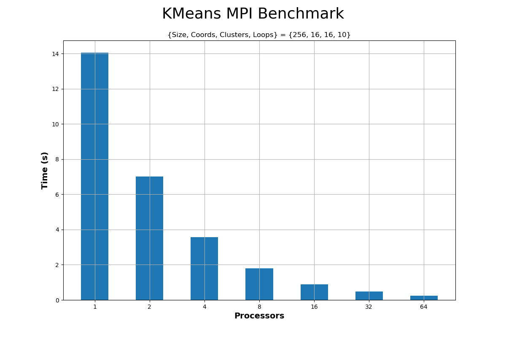
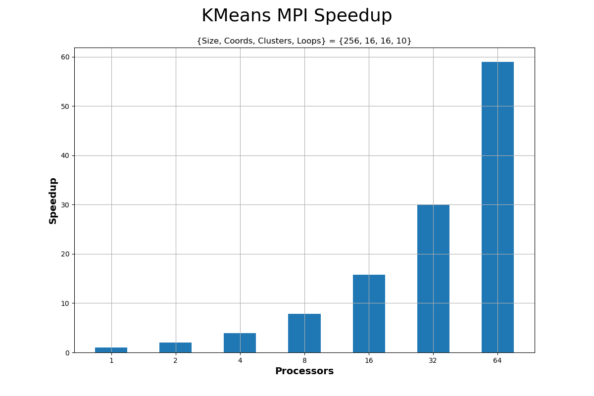

  
   
  <h3>ΕΘΝΙΚΟ ΜΕΤΣΟΒΙΟ ΠΟΛΥΤΕΧΝΙΟ</h3>
  <h4>ΣΧΟΛΗ ΗΛΕΚΤΡΟΛΟΓΩΝ ΜΗΧΑΝΙΚΩΝ ΚΑΙ ΜΗΧΑΝΙΚΩΝ ΥΠΟΛΟΓΙΣΤΩΝ</h4>
  <h5>Συστήματα Παράλληλης Επεξεργασίας</h5>
  <h6>Άσκηση 4:Παραλληλοποίηση και βελτιστοποίηση αλγορίθμων σε αρχιτεκτονικές κατανεμημένης μνήμης </h6>

---

| Όνομα | Επώνυμο | Α.Μ. |
|-------|---------|------|
| Αλτάν    | Αβτζή   | 03119241 |
| Τζόναταν | Λουκάι  | 03119230 |
| Σταύρος  | Λαζάρου | 03112642 |

 
 

## Αλγόριθμος K-means
### Μετρήσεις και αξιολόγηση
  - Γραφικές Παραστάσεις

Από τα αποτελέσματα αυτά παρατηρούμε ότι επιτυγχάνουμε σχεδόν γραμμική επιτάχυνση, όσο αυξάνονται οι επεξεργαστές, ειδικά μέχρι τους 16. Από τους 32 επεξεργαστές και μετά, οι αποδοτικότητα μειώνεται ελάχιστα αλλά παραμένει ικανοποιητικά ψηλά, υποδεικνύοντας ότι το σύστημα κατανεμημένης μνήμης αξιοποιεί αποτελεσματικά τους πόρους του.

## Διάδοση θερμότητας σε δύο διαστάσεις

### Μετρήσεις με έλεγχο σύγκλισης

<add configuration ,plots ,comments>

### Μετρήσεις χωρίς έλεγχο σύγκλισης

<add configuration ,plots ,comments>

