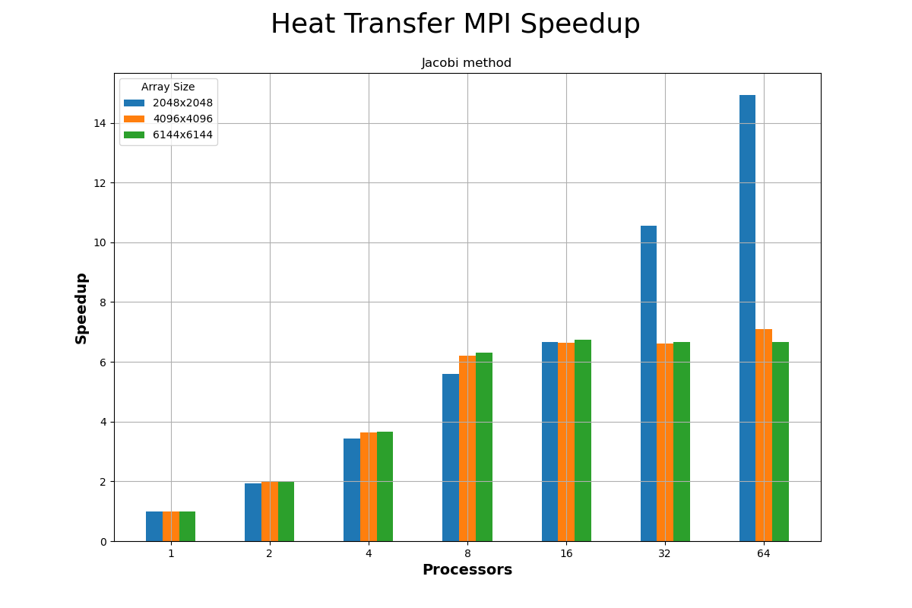
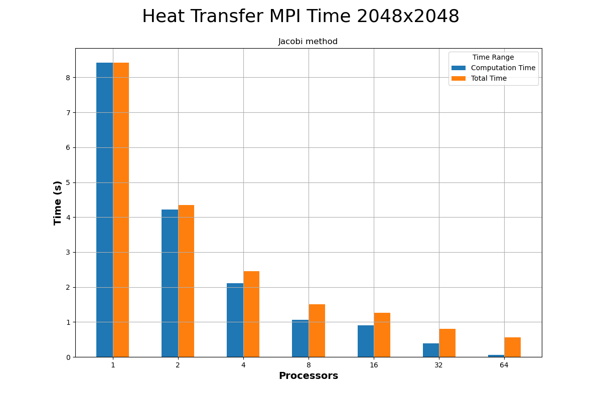
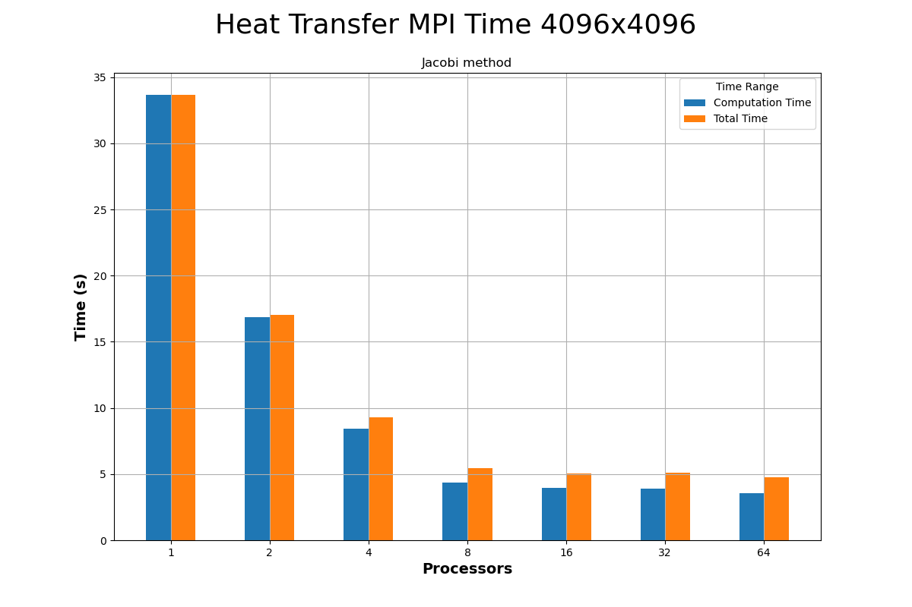
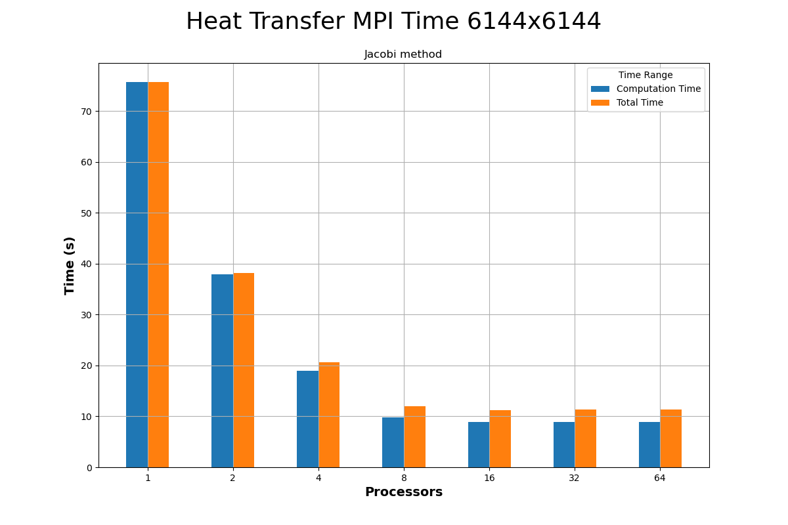

<div align='center'>
  
  <br/>
  <h3>ΕΘΝΙΚΟ ΜΕΤΣΟΒΙΟ ΠΟΛΥΤΕΧΝΙΟ</h3>
  <h4>ΣΧΟΛΗ ΗΛΕΚΤΡΟΛΟΓΩΝ ΜΗΧΑΝΙΚΩΝ ΚΑΙ ΜΗΧΑΝΙΚΩΝ ΥΠΟΛΟΓΙΣΤΩΝ</h4>
  <h5>Συστήματα Παράλληλης Επεξεργασίας</h5>
  <h6>Άσκηση 4: Παραλληλοποίηση και βελτιστοποίηση αλγορίθμων σε αρχιτεκτονικές κατανεμημένης μνήμης </h6>
</div>

---

| Όνομα | Επώνυμο | Α.Μ. |
|-------|---------|------|
| Αλτάν    | Αβτζή   | 03119241 |
| Τζόναταν | Λουκάι  | 03119230 |
| Σταύρος  | Λαζάρου | 03112642 |

<br/>
<br/>

## Αλγόριθμος K-means
### Μετρήσεις και αξιολόγηση
  - Γραφικές Παραστάσεις


Από τα αποτελέσματα αυτά παρατηρούμε ότι επιτυγχάνουμε σχεδόν γραμμική επιτάχυνση, όσο αυξάνονται οι επεξεργαστές, ειδικά μέχρι τους 16. Από τους 32 επεξεργαστές και μετά, οι αποδοτικότητα μειώνεται ελάχιστα αλλά παραμένει ικανοποιητικά ψηλά, υποδεικνύοντας ότι το σύστημα κατανεμημένης μνήμης αξιοποιεί αποτελεσματικά τους πόρους του.

## Διάδοση θερμότητας σε δύο διαστάσεις

### Υλοποίηση υπολογιστικού πυρήνα Jacobi

- Μοιρασμός των δεδομένων από τον καθολικό στους τοπικούς πίνακες
```c
MPI_Scatterv(U[0],scattercounts,scatteroffset,global_block,&u_current[1][1],1,local_block,0,MPI_COMM_WORLD);
zero2d(u_previous,local[0]+2,local[1]+2);
```
- Ορισμός τύπου δεδομένων γραμμών-στηλών
```c
MPI_Datatype column;
MPI_Type_vector(local[0],1,local[1]+2,MPI_DOUBLE,&dummy);
MPI_Type_create_resized(dummy,0,sizeof(double),&column);
MPI_Type_commit(&column);

MPI_Datatype row;
MPI_Type_contiguous(local[1],MPI_DOUBLE,&row);
MPI_Type_commit(&row);
```
- Εύρεση γειτονικών διεργασιών
```c
MPI_Cart_shift(CART_COMM,0,1,&north,&south);
MPI_Cart_shift(CART_COMM,1,1,&west,&east);
```
- Ορισμός ορίων επανάληψης
```c
i_min = 1;
i_max = local[0];
j_min = 1;
j_max = local[1];

//north
if (north == MPI_PROC_NULL) {
  i_min = 2;
}

//south
if (south == MPI_PROC_NULL) {
  int pad_i = global_padded[0] - global[0];
  i_max = local[0]-1-pad_i;
}

//east
if (east == MPI_PROC_NULL) {
  int pad_j = global_padded[1] - global[1];
  j_max = local[1]-1-pad_j;
}

//west
if (west == MPI_PROC_NULL) {
  j_min = 2;
}
```
- Κύριο loop. Αποστολή/παραλαβή δεδομένων προς/από γειτονικούς επεξεργαστές, και υπολογισμός
```c
swap=u_previous;
u_previous=u_current;
u_current=swap;

MPI_Request reqs[8];
MPI_Status stats[8];
int reqs_count = 0;

if (north != MPI_PROC_NULL) {
  MPI_Isend(&u_previous[1][1],1,row,north,0,CART_COMM,&reqs[reqs_count++]);
  MPI_Irecv(&u_previous[0][1],1,row,north,0,CART_COMM,&reqs[reqs_count++]);
}

if (south != MPI_PROC_NULL) {
  MPI_Isend(&u_previous[local[0]][1],1,row,south,0,CART_COMM,&reqs[reqs_count++]);
  MPI_Irecv(&u_previous[local[0]+1][1],1,row,south,0,CART_COMM,&reqs[reqs_count++]);
}

if (east != MPI_PROC_NULL) {
  MPI_Isend(&u_previous[1][local[1]],1,column,east,0,CART_COMM,&reqs[reqs_count++]);
  MPI_Irecv(&u_previous[1][local[1]+1],1,column,east,0,CART_COMM,&reqs[reqs_count++]);
}

if (west != MPI_PROC_NULL) {
  MPI_Isend(&u_previous[1][1],1,column,west,0,CART_COMM,&reqs[reqs_count++]);
  MPI_Irecv(&u_previous[1][0],1,column,west,0,CART_COMM,&reqs[reqs_count++]);
}

MPI_Waitall(reqs_count,reqs,stats);

gettimeofday(&tcs,NULL);

for (i=i_min;i<=i_max;i++) {
  for (j=j_min;j<=j_max;j++) {
    u_current[i][j]=(u_previous[i-1][j]+u_previous[i+1][j]+u_previous[i][j-1]+u_previous[i][j+1])/4.0;
  }
}

gettimeofday(&tcf,NULL);
tcomp+=(tcf.tv_sec-tcs.tv_sec)+(tcf.tv_usec-tcs.tv_usec)*0.000001;

#ifdef TEST_CONV
if (t%C==0) {
  converged = converge(u_previous,u_current,i_min,i_max,j_min,j_max);
  MPI_Allreduce(&converged,&global_converged,1,MPI_INT,MPI_LAND,MPI_COMM_WORLD);

}
#endif
```

- Συγκέντρωση των δεδομένων πίσω στον καθολικό πίνακα
```c
MPI_Gatherv(&u_current[1][1],1,local_block,U[0],scattercounts,scatteroffset,global_block,0,MPI_COMM_WORLD);
```

### Μετρήσεις με έλεγχο σύγκλισης

Ο χρόνος εκτέλεσης του προγράμματος για τη μέθοδο Jacobi ήταν κατά μέσο όρο:
 - Total time: 517s
 - Computation time: 40s

### Μετρήσεις χωρίς έλεγχο σύγκλισης

- Γραφικές Παραστάσεις






Παρατηρούμε εν γένει μια βελτίωση στους χρόνους εκτέλεσης με την αύξηση των επεξεργαστών, ωστόσο η επίδοση παραμένει σταθερή μετά τους 8 επεξεργαστές για τα μεγαλύτερα μεγέθη πινάκων.
